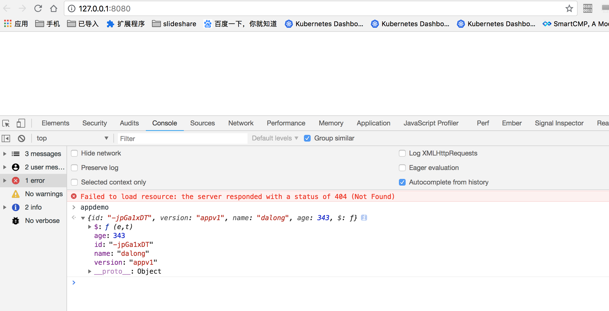

# rollup demo library build with babel

> include jquery && shortid && uglify

## How to Run(local)

* install deps

```code
yarn
```

* build

```code
yarn build
```

* live-server demo

```code
yarn live
```

## with docekr

* build image

```code
docker-compose build
```

* run

```code
docker-compose up -d
```

## demo images

